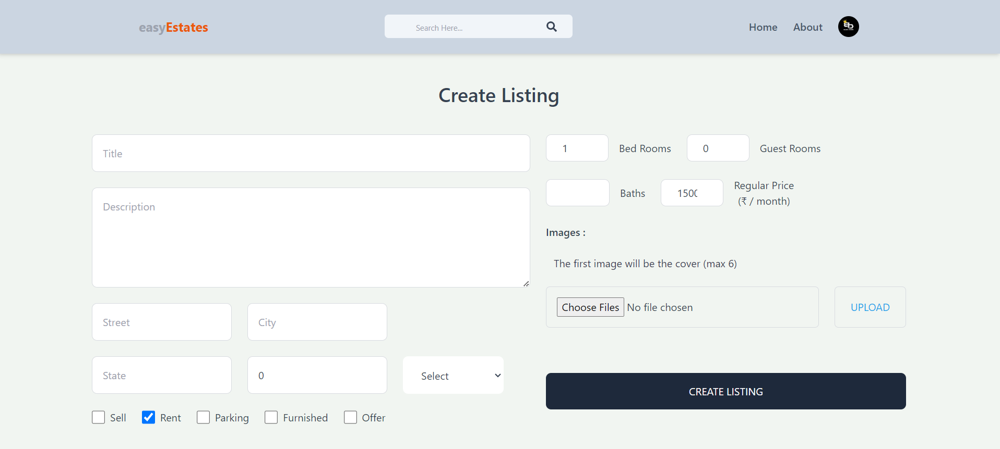

# easyEstates

## Description

easyEstates is a React-based real estate platform that allows users to search for properties available for sale or rent. The application utilizes Node.js, Express.js, React.js, Tailwind CSS, Firebase, and MongoDB (Atlas).

## Installation

Follow these steps to set up and run the project locally:

1. Clone the project: git clone [https://github.com/manu-hn]
2. Navigate to the base directory and install backend dependencies:

- cd easyEstates
- npm install

3. Create a .env file in the base directory and set the necessary environment variables for the backend:

- MONGODB_URL
- PORT (5000)
- JWT_SECRET_KEY
- SESSION_KEY
- JWT_EXPIRY

4. Run the frontend installation:

- cd frontend
- npm install

5. Create a .env file in the frontend directory and add the Firebase API key:

- FIREBASE_API_KEY

6. Install Tailwind CSS and make any necessary adjustments:
 - npm install tailwindcss
7. Choose either local or cloud storage (like MongoDB Atlas) for your MONGODB_URL in the .env file.

8. Start the project:
# Run backend
 - npm run dev

# Run frontend
 - npm run start
 
###### The backend will run on port 5000. If you change the port in the .env file, make sure to update it in the frontend CONSTANTS file as well. The frontend will be accessible at http://localhost:1234.

## Technologies Used
1. Node.js / Express.js
2. React.js and Tailwind CSS
3. Firebase
4. MongoDB (Atlas)
5. Parcel
6. Google OAuth

### Dependencies Used
1. Backend
 - http-status-codes
 - jwt
 - dotenv
 - bcryptjs
 - cors
 - cookie-parser
 - joi
 - generate-password
 - unique-username-generator
 - mongoose 

### Frontend
 - axios
 - dotenv
 - js-cookie
 - firebase
 - redux
 - react-redux
 - @reduxjs/toolkit
 - @coreui/coreui
 - @coreui/react 
 

## Features

easyEstates comes equipped with a range of features to enhance the user experience and make property management seamless:

1. **User Authentication:**
   - Secure user authentication system allows users to create accounts, log in, and manage their profiles.

2. **Property Search:**
   - Intuitive search functionality enables users to find properties for sale or rent based on various criteria such as parking, furnished, sort, and property type.

3. **Data CRUD Operations:**
   - Perform Create, Read, Update, and Delete operations on property listings. Users can add new listings, edit existing ones, and remove properties as needed.

4. **Responsive UI:**
   - A responsive and user-friendly interface ensures a seamless experience across various devices, including desktops, tablets, and mobile phones.

5. **Firebase Integration:**
   - Utilize Firebase services for features like user authentication and real-time updates, enhancing the overall performance and reliability of the application.

6. **Tailwind CSS Styling:**
   - Leveraging the power of Tailwind CSS for a clean and visually appealing design, providing a modern look and feel.

7. **Backend Security:**
   - Implement secure backend practices, including encryption, to protect sensitive user data and ensure the safety of the application.

## Screenshots

* This is a screenshot of the application Home Page.*

* This is a screenshot of the application About Page.*

* This is a screenshot of the application Search Page.*

* This is a screenshot of the application Search Page.*

For any questions, issues, or feedback, feel free to reach out:

- Email: [Manu H N](mailto:manuu.hnn@gmail.com)
